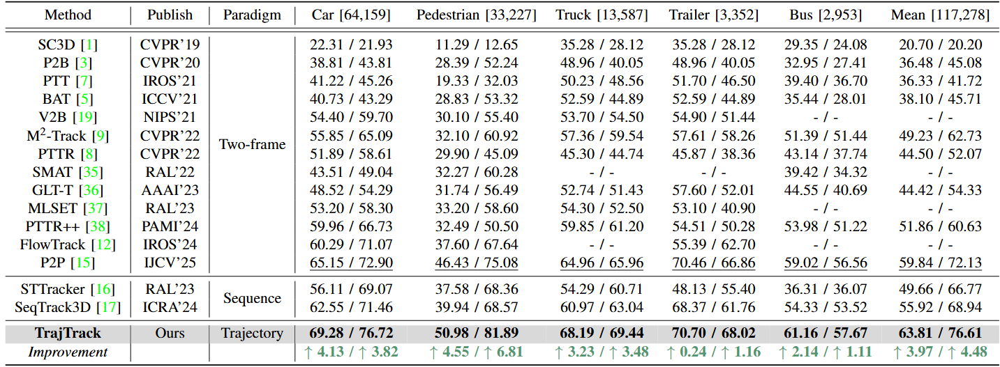

# TrajTrack 

The official implementation of the paper: 

**Beyond Frame-wise Tracking: A Trajectory-based Paradigm for Efficient Point Cloud Tracking**
>  BaiChen Fan, [Sifan Zhou](https://scholar.google.com/citations?user=kSdqoi0AAAAJ&hl=zh-CN&oi=ao), [Jian Li](https://scholar.google.com/citations?hl=zh-CN&user=cpo-QsMAAAAJ), [Shibo Zhao](https://scholar.google.com/citations?hl=zh-CN&user=dCGZsPkAAAAJ), [Muqing Cao](https://scholar.google.com/citations?hl=zh-CN&user=ddBNGlwAAAAJ), [Qin Wang](https://scholar.google.com/citations?user=uJUuhTYAAAAJ&hl=zh-CN&oi=ao).

[//]: # (> 📜 [[technical report]&#40;https://arxiv.org/abs/2407.05238&#41;], 🤗 [[model weights]&#40;https://drive.google.com/drive/folders/xx&#41;])

<div id="top" align="center">
<p align="center">

</p>
</div>

<div align="center">
<video width="1000" controls autoplay muted loop>
  <source src="figures/nus_car_case.mp4" type="video/mp4">
</video>
</div>

## 🔥 Highlights

**TrajTrack** is a strong tracking framework for 3D SOT on LiDAR point clouds that have:

- *New Trajectory-based Paradigm*.
- *Implicit motion modeling without multi point clouds*.
- *SOTA performance on NuScenes*.

<div id="top" align="center">
<p align="center">

</p>
</div>

<div id="top" align="center">
<p align="center">

</p>
</div>


[//]: # (## 📢 News)

[//]: # ()
[//]: # (> [!IMPORTANT])

[//]: # (> If you have any question for our codes or model weights, please feel free to concat me at jhnie@hdu.edu.cn.)

[//]: # ()
[//]: # (- **[2024/07/10]** We released the arxiv version at [here]&#40;https://arxiv.org/abs/2407.05238&#41;.)

[//]: # (- **[2024/07/07]** We released the installation, training, and testing details.)

[//]: # (- **[2024/07/06]** We released the implementation of our model.)

[//]: # ()
[//]: # (## 📋 TODO List)

[//]: # ()
[//]: # (- [ ] All caterogy model weights of point and voxel versions trained on KITTI, Nuscenes.)

## 🕹️ Getting Started

- [Installation](https://github.com/FiBonaCci225/TrajTrack/tree/main/docs/INSTALL.md)

- [Data Preparation](https://github.com/FiBonaCci225/TrajTrack/tree/main/docs/DATA.md)

- [Training](https://github.com/FiBonaCci225/TrajTrack/main/docs/TRAINING.md)

- [Testing](https://github.com/FiBonaCci225/TrajTrack/main/docs/TESTING.md)


## ❤️ Acknowledgement

Our implementation is based on [Open3DSOT](https://github.com/Ghostish/Open3DSOT), [P2P](https://github.com/haooozi/P2P) and [MMDetection3D](https://github.com/open-mmlab/mmdetection3d). Thanks for the great open-source work!

## ⭐ Citation

If any parts of our paper and code help your research, please consider citing us and giving a star to our repository.

```bibtex
@article{trajtrack,
 title={Beyond Frame-wise Tracking: A Trajectory-based Paradigm for Efficient Point Cloud Tracking,
 year={2025}
}
